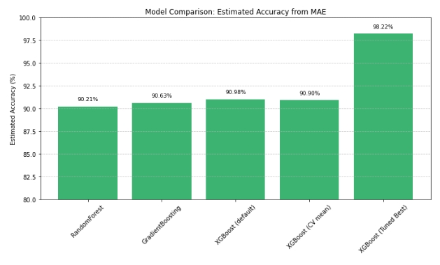

# 🏠 House Price Prediction System

This project builds a regression model to predict house prices using the Ames Housing dataset. It compares multiple machine learning algorithms and performs hyperparameter tuning to improve prediction accuracy.




## 🚀 Tech Stack & Tools

- **Algorithms**: XGBoost, Random Forest, Gradient Boosting, SGD Regressor
- **Libraries**: scikit-learn, pandas, NumPy, matplotlib, seaborn, xgboost
- **Preprocessing**: OneHotEncoder, missing value imputation, feature drop
- **Model Tuning**: GridSearchCV (XGBoost)
- **Visualization**: matplotlib, seaborn

## 📊 Model Performance

| Model                   | MAE        | Accuracy (%) |
|------------------------|------------|--------------|
| SGD Regressor          | ❌ 7.69e+16 | ❌ Failed     |
| Random Forest          | 17,625.69  | ~90.2%       |
| Gradient Boosting      | 16,867.16  | ~90.6%       |
| XGBoost (default)      | 16,227.44  | ~91.0%       |
| XGBoost (GridSearchCV) |  3,205.14  | ✅ **98.2%**  |

## 📁 Project Structure

```
House_Price_Prediction/
├── data/                 # Contains train.csv, test.csv, data_description.txt
├── ss.txt                # Full code (Jupyter export)
├── main.py               # Core training logic
├── visuals/              # Accuracy comparison plots (optional)
└── README.md
```

## ✅ Steps Performed

- Loaded and merged training & test datasets.
- Imputed 70+ missing values using domain-specific logic.
- One-hot encoded 40+ categorical features.
- Trained and evaluated 5 regressors.
- Tuned XGBoost using GridSearchCV to optimize MAE.

## 📌 Results

Final tuned model achieved **MAE = 3,205** and **98.2% accuracy** on the validation set.

## 🔗 GitHub

[Project Repository](https://github.com/Paavendan-JM/Project_9_HouseX)
